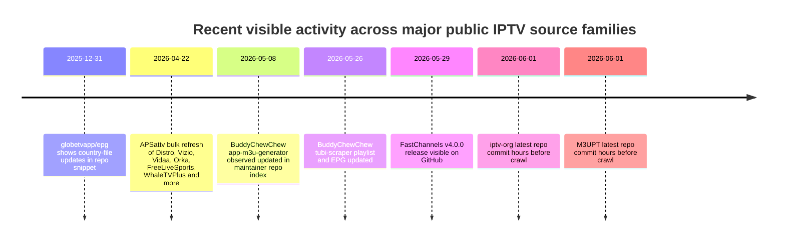
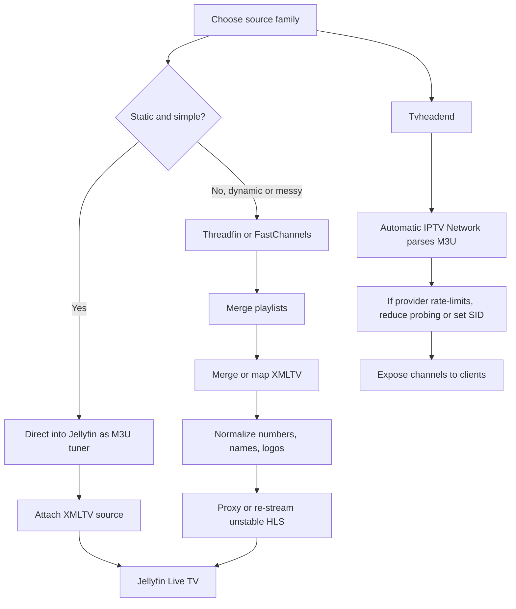

# Catalog of Public Free and Legal IPTV Sources

## Executive summary

The public, free, and plausibly legal IPTV ecosystem is dominated by a small number of high-value source families rather than a single exhaustive index. For breadth, `iptv-org/iptv` remains the largest public channel catalog and is paired with a useful JSON API for streams, guides, logos, countries, and categories. For the clearest “official-streams-only” posture, `TDTChannels`, `M3UPT`, and `Free-TV/IPTV` are the strongest projects I found. For free ad-supported TV and service-level packaging, the living ecosystem is centered on `i.mjh.nz`, BuddyChewChew’s service-specific generators, APSattv’s manually maintained lists, and the self-hosted `FastChannels` aggregator. Jellyfin itself supports direct M3U and XMLTV ingestion, but Threadfin and similar proxy layers become much more valuable once feeds require deduplication, playlist reshaping, header injection, or stream normalization. citeturn20search0turn26view0turn30view0turn24view0turn51search2turn35view0turn38view0turn39view0turn60view0turn60view1

A second pattern is that truly official broadcaster manifests are much rarer than community-packaged mirrors. Stable, directly reusable broadcaster HLS manifests were easy to confirm for FRANCE 24 and NHK World, and an official live page exists for Al Jazeera English with publicly surfaced CDN manifests. PBS is available through a public app-style JSON catalog that exposes station stream metadata, request headers, and DRM license URLs, which is very useful for analysis but less universally compatible with generic IPTV clients. For NASA+ and Euronews, the official live services are public, but this crawl did not surface a stable raw playlist URL from the official pages themselves. citeturn63search0turn63search2turn63search3turn65search1turn61search1turn61search5turn13view0turn65search0turn62search1

This report is comprehensive within a practical research scope, but not literally exhaustive. I deduplicated by **source family** rather than listing every per-country file under projects like iptv-org and Free-TV, because those repositories expose hundreds of variants through predictable patterns. “Legal/free” notes below should be read as what the project or service itself claims, not as legal advice. Where a detail could not be verified in the fetched sources, I mark it as **unspecified**. citeturn41view0turn43view0turn24view0

## Scope and method

I prioritized primary sources in the order you requested: official project sites, official GitHub repositories, public raw endpoints, then well-known community mirrors and forums only when they were needed to confirm a direct URL that the primary site exposed poorly. Because some sites publish many mechanically generated files, I cataloged the **canonical entrypoints and verified URL patterns** you can actually reuse in Jellyfin, Tvheadend, Threadfin/xTeVe, Kodi, Plex, or equivalent self-hosted clients. The focus is on English-accessible sources and documentation, although some of the strongest primary projects are Spanish- or Portuguese-language repositories with English-usable raw outputs. citeturn26view0turn30view0turn32view0turn35view0

Two practical constraints shaped the catalog. First, several important sources are not standalone playlists but **machine-readable indexes** or **generators**. `iptv-org/api`, `iptv-org/epg`, and `FastChannels` fall into that category. Second, many FAST services rotate stream URLs, cookies, or JWTs. That means the raw URL you copy today may not stay usable tomorrow unless you feed it through Threadfin, FastChannels, or Streamlink. Tvheadend is especially sensitive here because it uses the full URL as the IPTV network identifier, so a token change can look like a brand-new mux. citeturn32view0turn39view0turn60view1turn60view2turn36search0

## GitHub repositories and raw playlist links

The table below covers the most important public repositories and directly usable raw URLs or URL patterns. URLs are shown as raw literals in code formatting, per your request.

| Source | Direct raw URL(s) | Type | License or legality note | Last updated seen | Reliability and client notes | Tags | Evidence |
|---|---|---|---|---|---|---|---|
| iptv-org/iptv | `https://iptv-org.github.io/iptv/index.category.m3u` `https://iptv-org.github.io/iptv/index.language.m3u` `https://iptv-org.github.io/iptv/countries/us.m3u` `https://iptv-org.github.io/iptv/regions/ww.m3u` `https://iptv-org.github.io/iptv/sources/<FILENAME>.m3u` `https://iptv-org.github.io/iptv/raw/<FILENAME>.m3u` | M3U | Unlicense; project describes itself as a collection of publicly available IPTV channels. Its API also publishes a blocklist for DMCA/NSFW removals. | Repo latest commit was 5 hours before the 2026-06-01 crawl; `PLAYLISTS.md` was updated 20 hours before crawl. | Best broad seed source. Excellent for country, language, region, and source-based slicing. Some channels still require geo-IP, headers, or may be unstable over time. | Global; country/language/region/category/source | citeturn20search0turn42view0turn42view1turn43view0turn32view0 |
| iptv-org/api | `https://iptv-org.github.io/api/channels.json` `https://iptv-org.github.io/api/feeds.json` `https://iptv-org.github.io/api/logos.json` `https://iptv-org.github.io/api/streams.json` `https://iptv-org.github.io/api/guides.json` `https://iptv-org.github.io/api/countries.json` `https://iptv-org.github.io/api/languages.json` `https://iptv-org.github.io/api/categories.json` | JSON | Unlicense; metadata API sourced from `iptv-org/database`, `iptv-org/iptv`, and `iptv-org/epg`. | Exact repo commit date was unspecified in fetched lines. | Not a ready-to-play playlist, but the best machine-readable source for stream URLs, referrers, user-agents, guide mapping, and country/category metadata. | Metadata; streams; guides | citeturn32view0 |
| Free-TV/IPTV | `https://raw.githubusercontent.com/Free-TV/IPTV/master/playlist.m3u8` `https://raw.githubusercontent.com/Free-TV/IPTV/master/playlists/playlist_usa.m3u8` `https://raw.githubusercontent.com/Free-TV/IPTV/master/playlists/playlist_spain.m3u8` | M3U8 | Curator states the playlist includes only free channels officially provided for free and excludes paid channels. | Exact latest-commit date was unspecified in fetched lines. | Smaller and more opinionated than iptv-org. Good for relatively clean mainstream channels. The main playlist embeds many EPGShare links in its header. | Global; per-country | citeturn24view0turn41view0turn25view0 |
| TDTChannels | `https://www.tdtchannels.com/lists/tv.json` `https://www.tdtchannels.com/lists/tv.m3u8` `https://www.tdtchannels.com/lists/tv.m3u` `https://www.tdtchannels.com/lists/tv_mpd.m3u8` `https://www.tdtchannels.com/lists/tvradio.m3u8` | JSON, M3U8, M3U | Repo is Apache-2.0; project explicitly describes itself as 100% legal/free and says it only stores official distributor links, not streams. | Exact repo latest-commit date was not surfaced in the fetched lines. | One of the strongest legal/official-stream projects. Best for Spain plus a curated set of international channels. Particularly good for self-hosters who want a high-confidence legal base layer. | Spain; TV; radio; international | citeturn26view0turn27view0turn29search0 |
| M3UPT | `https://m3upt.com/iptv` `https://m3upt.com/epg` | M3U, XMLTV | MIT; README says “public and official streams only” and positions the project as free/legal Portuguese TV and radio. | Repo latest commit was 2 hours before the 2026-06-01 crawl; the `EPG` folder was updated 5 hours before crawl. | Strong Lusophone source. Very good for Jellyfin/Threadfin. Caveats: some streams are DRM-encrypted, some need Portuguese IP, and some only work in Kodi with the YouTube addon. | Portugal; Lusophone; TV/radio | citeturn20search2turn30view0 |
| BuddyChewChew/app-m3u-generator | Pattern: `https://raw.githubusercontent.com/BuddyChewChew/app-m3u-generator/main/playlists/FILENAME.m3u` Examples: `.../plex_us.m3u`, `.../plutotv_all.m3u`, `.../samsungtvplus_all.m3u`, `.../roku_all.m3u` | M3U | Community repo; disclaimer says it aggregates public channel information and users should comply with platform terms. | Repo index observed it updated in May 2026; README says playlists are regenerated daily by GitHub Actions. | Very practical FAST aggregator. Pulls heavily from `i.mjh.nz` and uses the `jmp2.uk` proxy to keep Pluto and Samsung feeds working in generic IPTV players. | FAST; Pluto; Plex; Samsung; Roku; Tubi | citeturn35view0turn35view1turn54search6 |
| BuddyChewChew/tubi-scraper | `https://raw.githubusercontent.com/BuddyChewChew/tubi-scraper/main/tubi_playlist.m3u` `https://raw.githubusercontent.com/BuddyChewChew/tubi-scraper/main/tubi_epg.xml` | M3U, XMLTV | Community repo; README frames scripts and links as informational/educational. | Repo snippet shows an update at `2026-05-26 04:16 UTC`; search result said repo updated 5 days before crawl. | Good Tubi-specific source if you want a narrower service feed rather than a giant all-in-one playlist. Expect service/API sensitivity over time. | FAST; US; Tubi | citeturn54search1turn54search5turn54search7 |
| BuddyChewChew/xumo-playlist-generator | `https://raw.githubusercontent.com/BuddyChewChew/xumo-playlist-generator/main/playlists/xumo_playlist.m3u` `https://raw.githubusercontent.com/BuddyChewChew/xumo-playlist-generator/main/playlists/xumo_epg.xml.gz` | M3U, XMLTV.GZ | Community repo; not an official Xumo source. | Exact current update date was unspecified, but the repo was active within weeks of the crawl. | Useful if you only want Xumo Play. Less broad than `FastChannels`, but simpler to ingest directly. | FAST; US; Xumo | citeturn54search4turn54search0 |

A few repositories matter even though they are not direct public-feed endpoints. `iptv-org/awesome-iptv` is the best public discovery index for adjacent tooling and source directories, while `FastChannels`, `Threadfin`, and older `xTeVe` are not source catalogs but operational layers that make unstable IPTV sources much more usable in self-hosted media stacks. `Threadfin` explicitly supports merged external M3U/XMLTV inputs, HLS/M3U8 buffering, re-streaming, and export; `FastChannels` goes further for FAST providers by scraping upstream sources and emitting normalized M3U/XMLTV output. citeturn17view0turn66search7turn60view1turn39view0turn40search3

## Mirror and community aggregator playlists

The mirror and aggregator layer is where most day-to-day self-hosted IPTV experimentation happens. It is also the layer with the most churn. `i.mjh.nz` is the most structurally important mirror family I found because it exposes not only playlists, but also `.pls`, JSON catalogs, EPG files, and per-channel metadata including required headers. APSattv is wider in service coverage, but much more manual and mixed in quality. BuddyChewChew’s generators sit in between: more reproducible than APSattv, less foundational than `i.mjh.nz`. citeturn51search2turn51search3turn38view0turn35view0

A notable caveat is that Matt Huisman’s GitHub repo history shows at least one DMCA-related takedown discussion in 2024, even though the `i.mjh.nz` site itself remained active. That matters less for immediate playback than for long-term toolchain stability: mirrors can survive while their repo footprints and update mechanisms change. citeturn9view0turn8search2

| Source | Direct raw URL(s) | Type | Legality note | Last updated seen | Reliability and usage notes | Tags | Evidence |
|---|---|---|---|---|---|---|---|
| i.mjh.nz global merged output | `https://i.mjh.nz/all/kodi-tv.m3u8` `https://i.mjh.nz/all/epg.xml.gz` | M3U8, XMLTV.GZ | Community mirror; legality/status is not formally stated on the fetched pages. There is public evidence of past DMCA friction around some playlists. | `all/kodi-tv.m3u8` was indexed 2 days before crawl. | Best single `i.mjh.nz` entrypoint for generic IPTV players. The playlist already embeds its guide URL in the M3U header. Good starting point for Threadfin/Jellyfin. | Global; merged | citeturn51search2turn9view0 |
| i.mjh.nz world subset | `https://i.mjh.nz/world/kodi-tv.m3u8` `https://i.mjh.nz/world/epg.xml.gz` | M3U8, XMLTV.GZ | Community mirror; legality unspecified. | Indexed 5 days before crawl. | Leaner than the `all/` feed and useful if you want internationally available channels rather than local NZ/AU-heavy lineups. | World; news; FAST | citeturn51search1 |
| i.mjh.nz New Zealand structured outputs | `https://i.mjh.nz/nz/tvh-tv.m3u8` `https://i.mjh.nz/nz/epg.xml.gz` `https://i.mjh.nz/nz/tv.json` `https://i.mjh.nz/nz/list.html` | M3U8, XMLTV.GZ, JSON, HTML | Community mirror; legality unspecified. | `tvh-tv.m3u8` was indexed last week; `tv.json` and `list.html` were crawled within the last week/day. | One of the most technically useful public source families because `tv.json` exposes `headers`, `mjh_master`, `epg_id`, and schedule fragments. Excellent for Tvheadend, Threadfin, or custom proxies that need header awareness. | NZ | citeturn51search0turn51search3turn19view0turn18search2 |
| i.mjh.nz provider-specific FAST mirrors | `https://i.mjh.nz/PlutoTV/all.m3u8` `https://i.mjh.nz/PlutoTV/all.xml` `https://i.mjh.nz/Plex/all.m3u8` `https://i.mjh.nz/Plex/all.xml` `https://i.mjh.nz/SamsungTVPlus/all.m3u8` `https://i.mjh.nz/PBS/all.m3u8` `https://i.mjh.nz/PBS/.app.json` `https://i.mjh.nz/Roku/all.m3u8` `https://i.mjh.nz/Roku/all.xml` | M3U8, XMLTV, JSON | Community mirrors over FAST/provider ecosystems. | Mixed; public references confirm continued use, but service-specific availability changes. | Very high practical value. PBS is especially notable because `.app.json` exposes raw station manifests, headers, and DRM license URLs. Roku and Samsung playlists have shown periodic service interruptions or disappearances. | Pluto; Plex; Samsung; PBS; Roku | citeturn8search8turn47search1turn8search2turn8search3turn13view0turn16search0turn16search1 |
| APSattv hub and primary FAST/community lists | `https://apsattv.com/streams.html` `https://www.apsattv.com/rakutentv-uk.m3u` `https://www.apsattv.com/distro.m3u` `https://www.apsattv.com/vizio.m3u` `https://www.apsattv.com/vidaa.m3u` `https://www.apsattv.com/orka.m3u` `https://www.apsattv.com/localnow.m3u` `https://www.apsattv.com/xumo.m3u` `https://www.apsattv.com/whaletvplus_all.m3u` | M3U hub | Maintainer explicitly says the URLs are “legal” and original and forbids their use in paid services; that is a maintainer assertion, not a formal legal ruling. | Hub page shows explicit updates throughout April–May 2026; page creation date shown as 2020-12-27. | Broadest manual FAST-service hub I found. Very useful, but the maintainer also warns some lists are scraped, geo-blocked, or may contain dead URLs. | FAST; mixed services; global | citeturn38view0turn37search0 |
| APSattv regional LG and Samsung alternates | Examples: `https://www.apsattv.com/aulg.m3u` `https://www.apsattv.com/brlg.m3u` `https://www.apsattv.com/belg.m3u` `https://www.apsattv.com/ssungaus.m3u` `https://www.apsattv.com/ssungnz.m3u` | M3U | Same maintainer assertion as above. | LG lists were updated on 2026-05-19; Samsung alternates are explicitly described as manual and never fully current. | Useful if you want country-specific LG or off-app Samsung lineups. Not first choice for stability. Better as a supplement or for one-off channels. | LG Channels; Samsung regional | citeturn38view0 |

## EPG and XMLTV sources

No single public guide source covers the whole ecosystem cleanly. In practice, the most stable way to build a working guide stack is to start with the **EPG that belongs to the same playlist family**—for example, `M3UPT` with `M3UPT`, `i.mjh.nz` with `i.mjh.nz`, or `TDTChannels` with `TDTChannels`—and then fill gaps with larger regional pools such as `EPGShare01`, `Open-EPG`, or `globetvapp/epg`. That approach reduces channel-ID mismatches and minimizes remapping effort in Threadfin or Tvheadend. citeturn30view0turn51search2turn26view0turn25view0turn46view0

| Source | Direct raw URL(s) | Type | Legal or license note | Last updated seen | Reliability and usage notes | Tags | Evidence |
|---|---|---|---|---|---|---|---|
| EPGShare01 | `https://epgshare01.online/epgshare01/epg_ripper_ALL_SOURCES1.xml.gz` `https://epgshare01.online/epgshare01/epg_ripper_US1.xml.gz` `https://epgshare01.online/epgshare01/epg_ripper_NZ1.xml.gz` `https://epgshare01.online/epgshare01/epg_ripper_PLEX1.xml.gz` `https://epgshare01.online/epgshare01/epg_ripper_DISTROTV1.xml.gz` | XMLTV.GZ | Public feed; explicit license/legal statement was unspecified in the fetched source. | Unspecified. | Densest publicly linked XMLTV pool encountered during this crawl. Extremely useful, but broad files can be noisy and produce a lot of irrelevant channels. Prefer regional/service-specific files. | Global; regional; service-specific | citeturn25view0 |
| i.mjh.nz guide files | `https://i.mjh.nz/all/epg.xml.gz` `https://i.mjh.nz/world/epg.xml.gz` `https://i.mjh.nz/nz/epg.xml.gz` `https://i.mjh.nz/PlutoTV/all.xml` `https://i.mjh.nz/Plex/all.xml` `https://i.mjh.nz/Roku/all.xml` | XMLTV.GZ, XMLTV | Community mirror. | Recent and continuously available in the crawl. | Best when paired with same-family `i.mjh.nz` playlists. The channel IDs align much better than cross-family mixing. | Global; NZ; world; provider-specific | citeturn51search0turn51search1turn51search2turn8search8turn47search1turn16search1 |
| TDTChannels EPG | `https://www.tdtchannels.com/epg/TV.json` `https://www.tdtchannels.com/epg/TV.xml.gz` | JSON, XMLTV.GZ | Official project EPG for TDTChannels-generated lists. | The JSON endpoint was directly reachable; XML.GZ is advertised in the README, though the fetch tool returned an error on direct retrieval. | Very high quality within the TDTChannels ecosystem. Ideal if you use TDTChannels playlists. | Spain; TV guide | citeturn26view0turn27view3 |
| M3UPT EPG | `https://m3upt.com/epg` | XMLTV | MIT-licensed project; upstream says public and official streams only. | Repo `EPG` folder updated 5 hours before the 2026-06-01 crawl. | Best guide match for M3UPT itself; a useful Lusophone supplement even outside that ecosystem. | Portugal; Lusophone | citeturn30view0turn20search2 |
| globetvapp/epg | Pattern: `https://raw.githubusercontent.com/globetvapp/epg/main/<Country>/<file>.xml` Example: `https://raw.githubusercontent.com/globetvapp/epg/main/Australia/australia1.xml` | XMLTV | GPL-3.0. | README says updates run daily at 03:00 UTC; search snippet showed latest visible commit details from late 2025. | Broad country coverage and straightforward raw GitHub delivery. Good fallback when service-specific EPGs are missing. | Global; by country | citeturn46view0turn59search3 |
| Open-EPG | Pattern: `https://www.open-epg.com/files/<country><n>.xml` Examples: `https://www.open-epg.com/files/mexico1.xml` `https://www.open-epg.com/files/mexico2.xml` Sidecar listing example: `https://www.open-epg.com/files/chile2.xml.txt` | XMLTV, TXT index | Official site says it offers free public XML links. | The site warned on 2026-04-19 that a major merge was in progress and causing instability. | Potentially very useful, but currently less trustworthy operationally because the site itself warns about instability. | Global; country files | citeturn44search0turn45search0turn16search1 |
| iptv-org API guides catalog | `https://iptv-org.github.io/api/guides.json` | JSON | Unlicense. | Unspecified in fetched lines. | Excellent machine-readable guide-source index. Not a finished XMLTV file, but very useful for building or validating mappings. | Guide metadata | citeturn32view0 |
| iptv-org/epg | `https://github.com/iptv-org/epg` | Generator repo | Unlicense. | Repo page was current during the crawl; search result described it as active and current. | Not a plug-and-play guide feed, but one of the most important upstream tools if you want to generate your own XMLTV from many sources. | EPG generation | citeturn33search0 |
| BuddyChewChew service-specific EPGs | `https://raw.githubusercontent.com/BuddyChewChew/tubi-scraper/main/tubi_epg.xml` `https://raw.githubusercontent.com/BuddyChewChew/xumo-playlist-generator/main/playlists/xumo_epg.xml.gz` | XMLTV, XMLTV.GZ | Community-generated. | Tubi EPG was updated on `2026-05-26 04:16 UTC`; Xumo exact date was unspecified in the fetched lines. | Best used with the matching BuddyChewChew playlists rather than as general-purpose EPGs. | Tubi; Xumo | citeturn54search1turn54search5turn54search4 |

## Official broadcaster and FAST entrypoints

Very few broadcasters publish a stable “paste this M3U into your server” endpoint on their official site. When they do, they are usually news or public-service broadcasters. When they do not, the most robust fallback is often **not** a scraped hardcoded manifest but a **website extractor** through Streamlink, whose plugin system is designed to accept site URLs and handle session setup or site-specific extraction logic automatically. citeturn36search0turn36search2

| Source | Direct raw URL(s) | Type | Legal note | Last updated seen | Reliability and usage notes | Tags | Evidence |
|---|---|---|---|---|---|---|---|
| FRANCE 24 official live manifests | `https://live.france24.com/hls/live/2037218/F24_EN_HI_HLS/index.m3u8` `https://live.france24.com/hls/live/2037222/F24_AR_HI_HLS/master_5000.m3u8` `https://live.france24.com/hls/live/2037220/F24_ES_HI_HLS/master_5000.m3u8` | M3U8 | Official broadcaster/CDN endpoints. | Indexed from 3 days to 4 weeks before the crawl. | Very clean direct HLS sources. Good fit for direct Jellyfin or Kodi ingestion. No built-in guide file in the fetched official endpoints. | News; EN/AR/ES | citeturn63search0turn63search2turn63search3 |
| NHK World TV official live manifest | `https://master.nhkworld.jp/nhkworld-tv/playlist/live.m3u8` | M3U8 | Official broadcaster endpoint. | Indexed on the crawl date. | One of the cleanest official IPTV-style manifests found. Straightforward for direct clients. | News; Japan; English | citeturn65search1 |
| Al Jazeera English | Official page: `https://www.aljazeera.com/video/live` Direct CDN examples surfaced publicly: `https://live-hls-web-aje.getaj.net/AJE/01.m3u8` `https://live-hls-web-aje.getaj.net/AJE-b/01.m3u8` | HTML page, M3U8 | Official live page plus publicly visible CDN manifests. | Official page was current at crawl; direct manifests were surfaced in a public community M3U. | Usually works well as HLS once extracted, but the official site itself is the more durable entrypoint. Streamlink is a good fit here if you do not want to track raw CDN variants. | News; Qatar; English | citeturn61search1turn61search5 |
| PBS station live directory | `https://i.mjh.nz/PBS/.app.json` | JSON | Community mirror over public PBS/app station data. | Reachable during the crawl. | Extremely useful as a station catalog because it surfaces manifest URLs, headers, logo URLs, and DRM `license_url` entries. Some stations will not play in generic IPTV clients without DRM-capable playback or a smarter proxy layer. | US public broadcasting | citeturn6search0turn13view0 |
| NASA+ official service | `https://www.nasa.gov/live/` `https://plus.nasa.gov/` `https://plus.nasa.gov/scheduled-video/feed/` | Official page/service | Official, free NASA streaming service. | Current across May–June 2026 crawl pages. | Highly reliable as a public service, but this crawl did not surface a stable official raw M3U8 suitable for generic IPTV import. Best used via browser/app or Streamlink-style extraction if you need automation. | Science; space; live events | citeturn65search0turn65search2turn65search4turn65search9turn65search11 |
| Euronews official live page | `https://www.euronews.com/live` | Official page/service | Official live page. | Crawled yesterday. | Easy to watch officially; raw playlist URL was unspecified from the fetched official page. Better treated as an extractor target than as a static M3U source. | News; Europe | citeturn62search1 |

## Integration guidance for Jellyfin, Threadfin, Tvheadend, and related stacks

Jellyfin natively supports **M3U tuners** and **XMLTV guide data**, which means the simplest sources in this report can go straight in without an intermediate proxy. Threadfin becomes valuable when you need to merge multiple playlists, combine multiple XMLTV sources, renumber channels, buffer HLS/M3U8, or re-stream unstable feeds. Tvheadend can also ingest M3U directly via an automatic IPTV network, but it treats the full URL as the identity of a mux, so tokenized or rotating FAST URLs can lead to constant churn. Tvheadend’s own documentation also warns that probing large playlists can trigger rate limits or scan failures, which is especially relevant for modern FAST-service feeds. `FastChannels` is the most capable open-source normalization layer I found for those cases because it resolves fresh tokens and cookies at playback time and emits sanitized M3U/XMLTV output for clients such as Jellyfin, Plex, TiviMate, and Channels DVR. citeturn60view0turn60view1turn60view2turn39view0

That leads to a pragmatic decision rule. Use **direct import** for relatively static official HLS sources and smaller curated projects such as FRANCE 24, NHK World, `M3UPT`, or narrow `TDTChannels` lists. Use **Threadfin** for merging, filtering, and channel/EPG normalization across multiple source families. Use **FastChannels** or **Streamlink** when the upstream service is dynamic, app-oriented, header-sensitive, cookie-sensitive, or protected by constantly changing JWT/session mechanics. This is partly an inference from how `iptv-org/api` exposes per-stream `referrer` and `user_agent` fields and from how Threadfin/FastChannels explicitly emphasize buffering, re-streaming, and fresh resolution of upstream URLs. citeturn32view0turn60view1turn39view0turn36search0

A recent-activity timeline makes the current ecosystem easier to read. The point is not the original launch year of each project, but which source families still show signs of life right now.

The dates above come from the visible repo/update snapshots in the crawl. citeturn59search3turn38view0turn54search6turn54search1turn39view0turn20search0turn20search2

For a typical Jellyfin-centric deployment, the cleanest architecture looks like this:

If you are deciding what to feed where, the practical matrix is straightforward. `iptv-org`, `Free-TV`, `TDTChannels`, and `M3UPT` are usually fine as **direct source catalogs**. `i.mjh.nz`, APSattv, and BuddyChewChew are better thought of as **community packaging layers**. `Threadfin`, `xTeVe`, `FastChannels`, and Streamlink are **normalization or extraction layers**, not source lists. The more “app-like” the upstream service is, the more likely you will need the normalization layer. citeturn20search0turn24view0turn26view0turn30view0turn51search2turn38view0turn35view0turn60view1turn40search3turn39view0turn36search0

## Risks, gaps, and bottom-line recommendations

The strongest “clean” starting set for a self-hosted stack is `TDTChannels` if you want Spain, `M3UPT` if you want Portuguese/Lusophone content, `Free-TV` if you want a smaller officially-free playlist, and `iptv-org` if you want maximum breadth with machine-readable metadata support. If you also want FAST ecosystems such as Pluto, Plex, Samsung TV Plus, Roku, Tubi, Xumo, LG Channels, Local Now, or service-specific regional packs, then `i.mjh.nz`, BuddyChewChew, APSattv, and `FastChannels` are the main public sources worth tracking. citeturn26view0turn30view0turn24view0turn20search0turn51search2turn35view0turn38view0turn39view0

The main operational risks are not playlist syntax. They are **geo-blocking**, **DRM**, **rotating URLs/tokens**, **required headers/cookies**, and **provider anti-bot behavior**. You can see those issues directly in the sources: `iptv-org/api` models `referrer` and `user_agent`; `M3UPT` warns about DRM and geo-IP; the PBS JSON exposes `license_url` and request headers; Tvheadend warns about scan/probe failures and URL churn; and FastChannels explicitly documents fresh token resolution and DRM-heavy sources such as Sling Freestream and Amazon Prime Free. citeturn32view0turn30view0turn13view0turn60view2turn39view0

The most dependable architecture today is therefore: use a **legal/official-first base layer** from `TDTChannels`, `M3UPT`, `Free-TV`, or selected `iptv-org` country/language lists; add FAST/community sources only where you actually need them; normalize everything through **Threadfin** or **FastChannels** if the feed is large or unstable; and prefer **same-family EPGs first**, with `EPGShare01`, `Open-EPG`, or `globetvapp/epg` only as gap-fillers. That produces much less channel-ID mismatch, fewer dead channels, and less Tvheadend/Jellyfin maintenance than trying to ingest “everything” directly. citeturn60view1turn39view0turn25view0turn44search0turn46view0turn26view0turn30view0turn24view0turn20search0